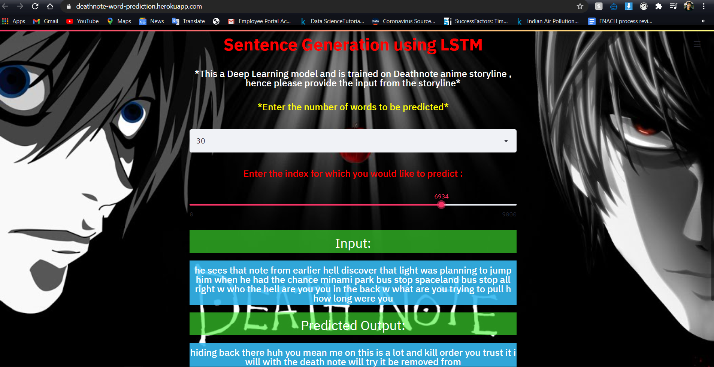
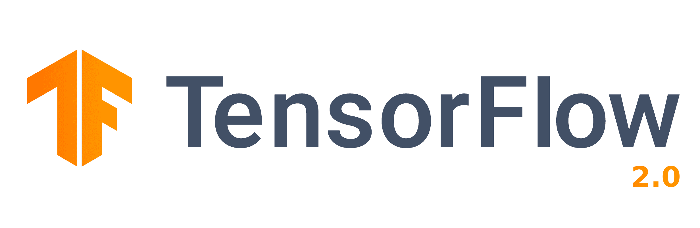

# Deathnote-word-prediction LSTM model .

### Death Note (Japanese: デスノート, Hepburn: Desu Nōto) is a Japanese manga series written by Tsugumi Ohba and illustrated by Takeshi Obata. The story follows Light Yagami, a teen genius who stumbles across a mysterious otherworldly notebook: the "Death Note", which belonged to the Shinigami Ryuk and grants the user the supernatural ability to kill anyone whose name is written in its pages.

## *Made a LSTM word-prediction model on Deathnote Anime and it turned out pretty good !*

## *Web app url* = https://deathnote-word-prediction.herokuapp.com/

### *Files* : 
#### 1 - Model-deploy-lstm.py - Code for the design and deploy of LSTM model
#### 2 - lstm-word-prediction.ipynb - IPYNB file for the training of LSTM model using the data
#### 3 - Deathnote-script.txt - The deathnote data script ,which I scraped from the web
#### 4 - Checkpoint - The checkpoint of LSTM
#### 5 - lstm-model-DN-v1.ckpt.index - Weights of the trained LSTM model

### *Local Host* : 
#### 1 - Clone / download the zip file
#### 2 - Give the correct path of the data file into model-deploy-lstm.py
#### 3 - Run - Streamlit run model-deploy-lstm.py

### *Framework and Tools* : 

### *If you liked this project , do give a star :)
